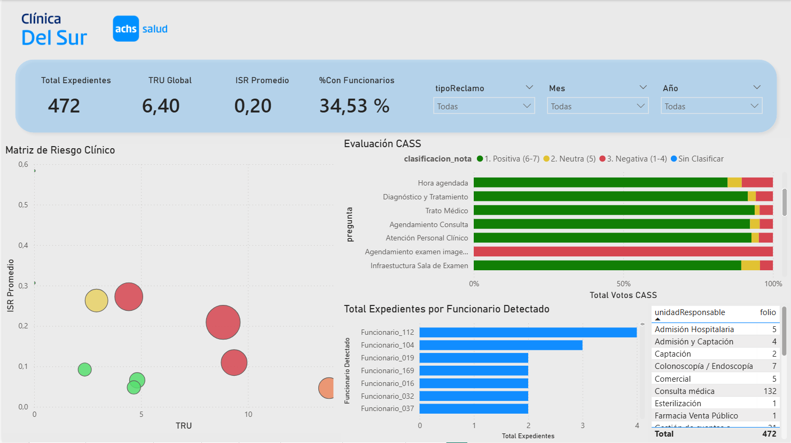
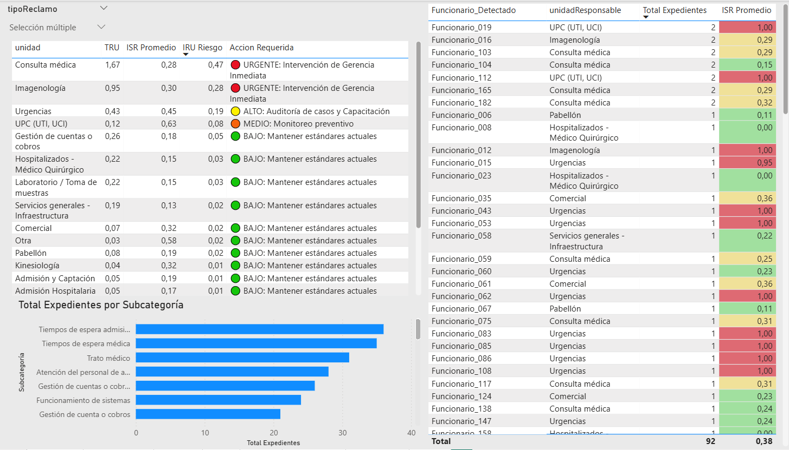
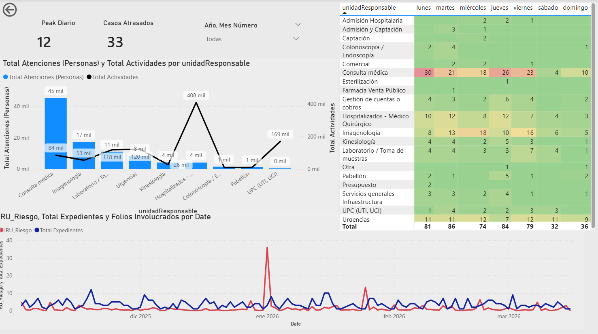
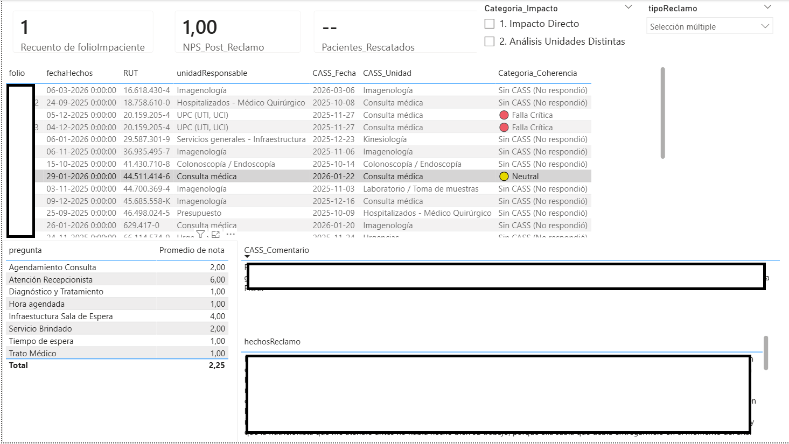
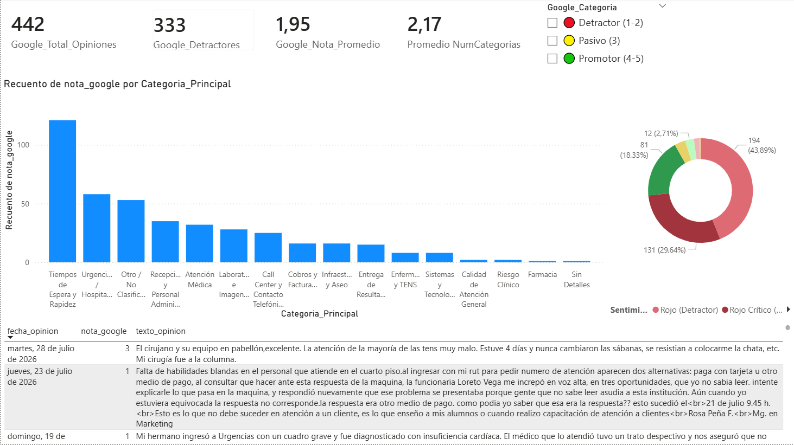
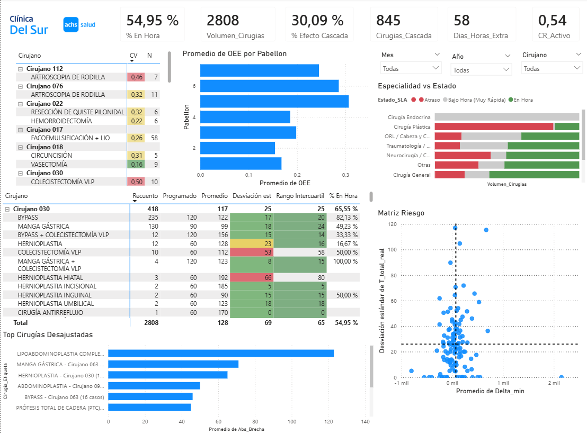
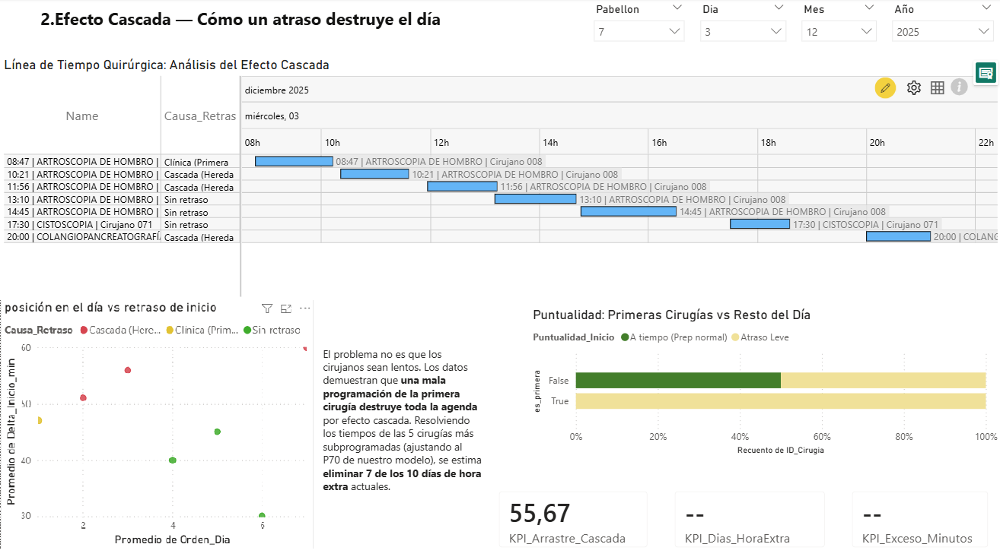
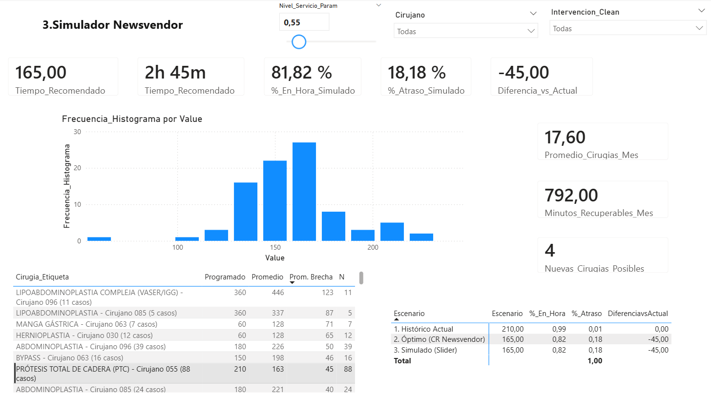
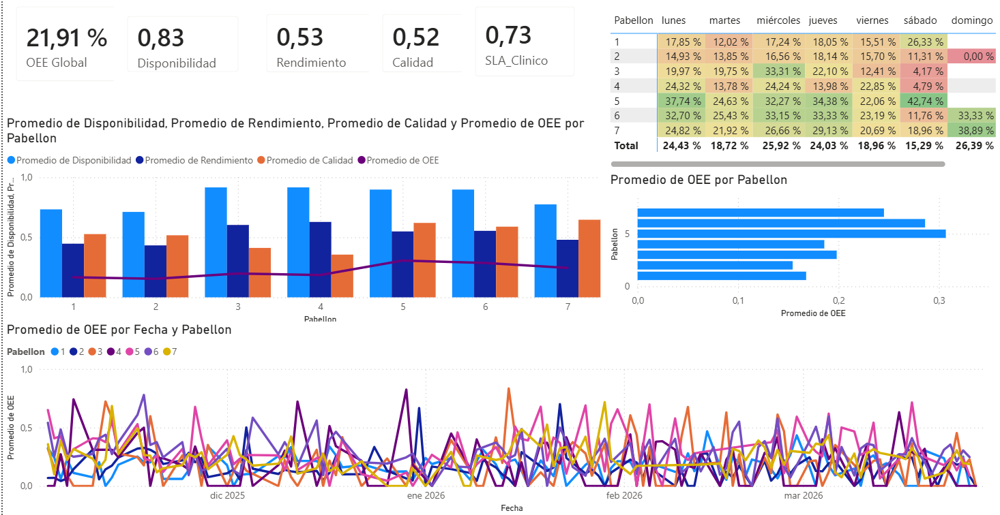
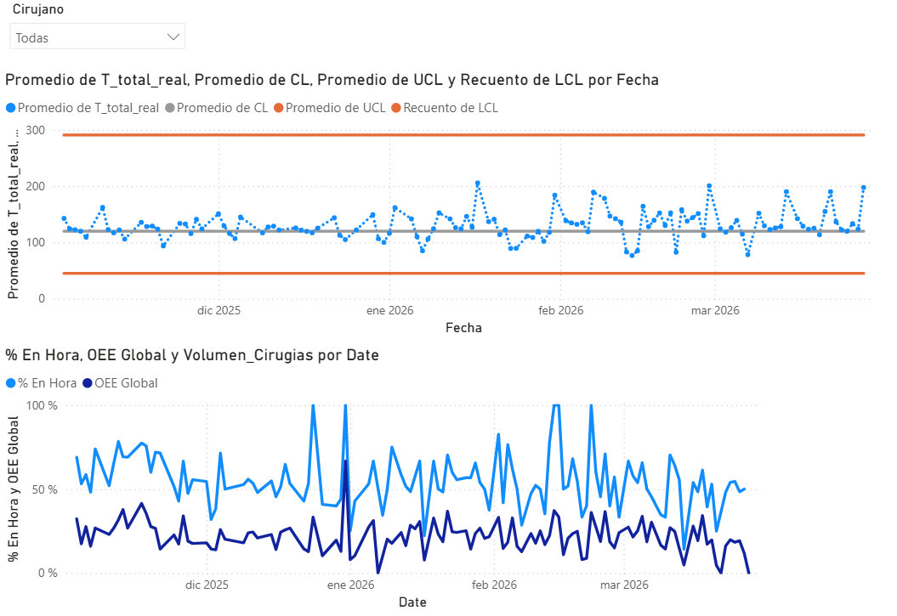

## Proyecto 1: Sistema de Inteligencia de Clientes, NLP y Triage de Riesgo Operacional

> **Nota de Seguridad:**
> En cumplimiento con la normativa de protección de datos (Ley N° 20.584 y estándares de confidencialidad médica):
> 1. Se eliminaron todos los nombres reales del personal clínico y administrativo, sustituyéndolos por identificadores sintéticos secuenciales (`Funcionario_001`, `Funcionario_002`, etc.).
> 2. Los RUTs de pacientes fueron generados aleatoriamente resguardando la integridad referencial para los cruces entre sistemas (CASS y MasterKey).
> 3. Las métricas cuantitativas y volúmenes sufrieron una perturbación estocástica de ($\pm 5\% - 10\%$) para evitar la exposición de datos financieros/operativos sensibles sin alterar las tendencias ni las conclusiones del modelo.
> 4. **Nota sobre el desarrollo del código:** La elaboración avanzada y optimización de los scripts en Python y SQL (DuckDB) contó con el apoyo de herramientas de Inteligencia Artificial, utilizadas como asistente para la estructuración de algoritmos de fuzzy matching, expresiones regulares.

---

### Contexto Operativo y Problema de Negocio
Las instituciones de salud reciben diariamente cientos de interacciones cualitativas a través de canales formales (sistema de reclamos/expedientes) e informales (encuestas CASS/Fibra y Google Reviews). Históricamente, el procesamiento de esta "Voz del Cliente" sufría de tres cuellos de botella:
1. **Falta de Priorización por Riesgo:** Todos los reclamos se trataban por igual en una cola FIFO, ignorando eventos centinela o de riesgo legal/ético crítico.
2. **Sesgo de Volumen Bruto:** Las unidades de alto flujo (ej. Consulta Médica) registraban mayor cantidad de quejas simplemente por atender a más pacientes, castigando injustamente su gestión frente a áreas pequeñas.
3. **Desconexión Transaccional:** Imposibilidad de vincular el relato cualitativo con la actividad operacional real del paciente en el Core Hospitalario.

---

### Justificación Metodológica y Técnicas de Ingeniería

Para transformar texto no estructurado en inteligencia accionable, se aplicaron las siguientes metodologías:

* **Triage Algorítmico y NLP (Fuzzy Matching):** En lugar de depender de lecturas manuales, se desarrolló un motor en Python que utiliza la **Distancia de Levenshtein** (`token_sort_ratio`) para identificar a los funcionarios involucrados dentro del relato del paciente, superando barreras de faltas de ortografía o alias. Se cruzó esta extracción contra nóminas internas y externas.
* **Control del Sesgo de Supervivencia:** Se demostró matemáticamente que las encuestas de satisfacción tradicionales (CASS) sufrían de un sesgo crítico: solo medían a los pacientes que completaban su atención. Al triangular estos datos con los reclamos operativos, se visibilizó la "Tasa de Fuga Operacional" (pacientes que abandonaban el recinto por fallas logísticas antes de ser facturados).
* **Ingeniería de Datos y Procesamiento (DuckDB):** Para vincular relatos cualitativos con millones de transacciones de caja, se utilizó DuckDB por su capacidad de procesamiento en memoria. Se programó un *Time-Window Join* dinámico (-60 a +30 días) que asocia probabilísticamente el reclamo al episodio clínico más probable.

---

### Definiciones de Métricas e Indicadores de Riesgo

Para normalizar la comparación entre unidades de distinto tamaño y severidad, se diseñó e implementó los siguientes indicadores:

* **1. ISR (Índice de Severidad del Reclamo - $ISR \in [0, 1]$):**
    Mide la *gravedad o impacto legal/clínico/emocional* del texto. Un algoritmo de NLP escanea palabras clave críticas (ej. *"Superintendencia"*, *"Negligencia"*, *"Gritos"*, *"Cobro indebido"*) y calcula un puntaje ponderado. Un $ISR = 1.0$ representa un evento crítico de alto riesgo legal.
* **2. TRU (Tasa de Riesgo Unificado):**
    Normaliza la *frecuencia* de reclamos en función del volumen operado. Evita el sesgo de comparar unidades masivas contra unidades pequeñas:
    $$\text{TRU} = \frac{\text{Total de Expedientes}}{\text{Total de Atenciones (Pacientes Únicos)}} \times 1.000$$
    *Nota técnica:* Se distingue entre **Atenciones** (pacientes únicos que ingresan a la unidad) y **Actividades** (volumen de insumos/procedimientos ejecutados, ej. jeringas, exámenes), demostrando matemáticamente la densidad operativa.
* **3. IRU Riesgo (Índice de Riesgo Unificado):**
    Ponderación matricial entre la *frecuencia relativa* (TRU) y el *impacto/severidad promedio* ($ISR$). Identifica la prioridad real de intervención gerencial:
    $$\text{IRU Riesgo} = \text{TRU} \times \overline{ISR}$$

---

### Interfaz Ejecutiva de Control (Estructura del Dashboard en Power BI)

  
 <b>Despliega aquí para explorar el desglose de las 6 Páginas del Dashboard</b>

#### Página 1: Matriz Corporativa de Riesgo y Evaluación CASS
* **Matriz de Riesgo Unificado (Scatter Plot):** Gráfico de dispersión cruzando la **TRU** vs. **ISR Promedio**, donde cada burbuja representa una unidad clínica. Permite identificar de un vistazo las áreas en la "Zona Roja" (alta tasa de reclamo y alta severidad).
* **Evaluación de Satisfacción CASS:** Distribución cualitativa de las preguntas de la encuesta de experiencia y su correspondiente nota/calificación (NPS)
* **Monitores de Volumen:** Tarjetas y gráficos de distribución de `Total Expedientes por Funcionario` y `Total Expedientes por Unidad`.

#### Página 2: Responsabilidad de Funcionarios y Subcategorías
* **Tabla de Gestión por Unidad:** Cuadro consolidado mostrando `Unidad`, `TRU`, `ISR Promedio` e `IRU Riesgo`.
* **Tabla de Responsabilidad de Personal:** Desglose individual de `Funcionario` (ej. *Funcionario_014*), `Unidad`, `Total Expedientes asociados` e `ISR Promedio`.
* **Análisis Causal:** Gráfico de barras de `Total Expedientes por Subcategoría` (Trato, Tiempos de Espera, Facturación, etc.).

#### Página 3: Normalización por Carga Operativa y Mapeo Temporal
* **Capacidad vs. Reclamos (Gráfico Combinado):** Columnas que comparan `Total Atenciones` (pacientes) vs. `Total Actividades` (insumos/prestaciones) por Unidad, superpuestas con una línea de `Total Expedientes`. 
    * *Justificación de Negocio:* Explica visualmente por qué Consulta Médica genera más quejas brutas (alto volumen de atenciones) y permite justificar la necesidad del indicador TRU.
* **Heatmap Temporal (Unidad vs. Día de la Semana):** Mapa de calor que expone los peaks operativos de quejas (ej. demostrando que *Consulta Médica* colapsa los días *Lunes*).
* **Evolución Severidad vs. Volumen (Gráfico de Doble Eje):** Línea de tiempo (`Fecha` vs. `IRU Riesgo` y `Total Expedientes`) para auditar días donde, con pocos reclamos, el riesgo fue críticamente alto.

#### Página 4: Triangulación CASS vs. Expedientes (Cruce de RUTs)
* **Propósito:** Cruce transaccional en DuckDB que identifica pacientes que hicieron un reclamo formal y que, a su vez, contestaron la encuesta de satisfacción CASS.
* **Caso 1 (Misma Unidad):** El problema reportado en el reclamo coincide con la unidad evaluada en CASS (falla acotada y localizada).
* **Caso 2 (Contagio Inter-Unidad):** El reclamo pertenece a una unidad (ej. *Admisión*), pero la mala nota en CASS se reflejó en otra (ej. *Consulta Médica*). Evidencia el "efecto contagio" en la percepción del paciente.

#### Página 5: Análisis de Sentimiento en Google Reviews
* Categorización y conteo de reseñas públicas de Google mediante NLP, clasificadas por categoría principal de servicio y sentimiento.

#### Página 6: Co-Ocurrencia de Problemas y Patrones Semanales
* **Matriz de Frecuencia Cruzada:** Análisis de co-ocurrencia de dos problemas simultáneos en una misma reseña (ej. *Pésimo Trato + Espera Excesiva*).
* **Heatmap de Reseñas:** Categoría de queja en Google vs. Día de la semana de mayor impacto cualitativo.

[Página 6 - Co-Ocurrencia de Problemas y Patrones Semanales](assets/nlp_reclamos/06pagina6.png)

---

### Arquitectura del Pipeline y Scripts (Proyecto 1)

Los scripts correspondientes a este módulo están organizados en `scripts/nlp_reclamos/`:

1.  **`01_procesar_expedientes.py`:** Motor de NLP en Python que realiza extracción de entidades nombradas (NER), fuzzy matching contra nóminas de personal y cálculo automatizado del puntaje ISR.
2.  **`02_pipeline_duckdb.py`:** Pipeline SQL de alto rendimiento en DuckDB que agrupa eventos en episodios clínicos y realiza la vinculación espacio-temporal (-60 a +30 días) entre reclamos, encuestas CASS y transacciones de MasterKey.
3. **`03_extraccion_google_reviews.py`:** Módulo de extracción automatizada de reseñas públicas. **Objetivo estratégico:** Capturar la "Voz del Cliente Informal". Se demostró que las fricciones operacionales menores a menudo no escalan a un reclamo legal formal (debido a la fricción del proceso), pero impactan críticamente la reputación digital. Este script elimina ese punto ciego.
4. **`04_clasificacion_opiniones_nlp.py`:** Motor de clasificación NLP para etiquetar el sentimiento y categorizar la causa raíz de las reseñas web. **Objetivo estratégico:** Automatizar la detección de co-ocurrencia de fallas sistémicas (ej. *Espera Excesiva + Mal Trato*) y cruzar la percepción pública con los días de mayor colapso operacional interno.
5. **`05_anonimizador_reclamos.py`:** Módulo criptográfico para seudonimización de identidades de personal y aleatorización de llaves de cruce transaccional (RUTs), asegurando el cumplimiento normativo.

---
---

## Proyecto 3: Optimización Estocástica y Capacidad de Pabellón Quirúrgico (OEE, Newsvendor & SPC)

> **Nota de Confidencialidad y Enmascaramiento de Datos:**
> En cumplimiento con la normativa de protección de datos (Ley N° 20.584 sobre derechos y deberes del paciente) y protocolos de confidencialidad institucional:
> 1. Se aplicó un algoritmo de enmascaramiento que sustituye los nombres reales de los médicos cirujanos por identificadores sintéticos secuenciales (`Cirujano 001`, `Cirujano 002`, etc.) de forma consistente en todas las tablas relacionales del modelo.
> 2. Las métricas de tiempo y volúmenes sufrieron una perturbación estocástica de ($\pm 5\% - 10\%$) para proteger información operativa interna sensible sin alterar la variabilidad estructural, distribuciones de probabilidad ni conclusiones técnicas.
> 3. **Declaración sobre el desarrollo de código:** El diseño de la arquitectura ETL, contaron con el apoyo de herramientas de Inteligencia Artificial como asistencia técnica para la escritura de scripts en Python y aceleración algorítmica.

---

### Contexto Operativo y Marco Teórico de Ingeniería

La gestión de quirófanos en instituciones de salud de alta complejidad representa uno de los problemas de asignación de capacidad estocástica más exigentes en la Ingeniería de Procesos. El bloque quirúrgico actúa como el principal centro de costos y generador de ingresos de la institución. Históricamente, la planificación se realizaba mediante promedios aritméticos simples o estimaciones heurísticas basadas en el juicio de los profesionales, lo que generaba dos ineficiencias opuestas:

1. **Subprogramación (Underbooking):** Asignar bloques de tiempo inferiores a la duración real del procedimiento, provocando atrasos sistemáticos, horas extraordinarias no planificadas, fatiga del personal y reprogramación de cirugías electivas.
2. **Sobreprogramación (Overbooking):** Asignar bloques excesivamente holgados, generando capacidad ociosa (costo de oportunidad por pabellón vacante) que no puede ser vendida ni reasignada en el corto plazo.

---

### Conceptos Clave y Fundamento Matemático

#### 1. Tolerancia SLA y Clasificación de Duración
Para evaluar el cumplimiento de la programación, se definió una holgura operativa explícita de $\pm 15$ minutos respecto al bloque asignado:
* **Bajo Hora:** Cirugía finalizada más de 15 minutos antes de lo programado ($\Delta t < -15 \text{ min}$).
* **En Hora:** Cirugía finalizada dentro del rango de tolerancia de $\pm 15$ minutos ($ -15 \text{ min} \le \Delta t \le +15 \text{ min}$).
* **Atraso:** Cirugía que excede el bloque programado en más de 15 minutos ($\Delta t > +15 \text{ min}$).

#### 2. Efecto Cascada
Fenómeno operativo en el cual el retraso inicial en la primera cirugía de la jornada en un pabellón se propaga de forma acumulativa e incremental hacia las cirugías subsecuentes del mismo bloque diario, amplificando el tiempo de espera de los pacientes siguientes y desencadenando horas extraordinarias.

#### 3. Desviación Estándar ($\sigma$) vs. Rango Intercuartil ($IQR$)
Debido a que la duración de los procedimientos quirúrgicos presenta un marcado sesgo positivo (cola derecha larga generada por complicaciones o fricciones logísticas), la Desviación Estándar ($\sigma$) tiende a sobreestimar la dispersión al ser altamente sensible a valores atípicos (*outliers*). Por ello, se incorpora el Rango Intercuartil ($IQR = Q_3 - Q_1$) como una medida robusta de dispersión no paramétrica para evaluar la variabilidad central del tiempo quirúrgico.

#### 4. Modelo de Vendedor de Periódicos (Newsvendor) y Ratio Crítico ($CR$)
El modelo de Newsvendor se adapta de la teoría de inventarios estocásticos para resolver el dilema de balance de capacidad en entornos de demanda incierta. 

* **Costo de Atraso ($C_u$ - Underage Cost):** Costo marginal por minuto de subprogramar el pabellón (incluye pago de horas extra a personal de enfermería/pabellón, retención de pacientes en salas de espera y penalización por quiebre de SLA).
* **Costo de Ocio ($C_o$ - Overage Cost):** Costo de oportunidad marginal por minuto de sobreprogramar el pabellón (pabellón reservado pero no utilizado, imposibilitado de ser asignado a otra cirugía).

El **Ratio Crítico ($CR$)** determina el percentil óptimo ($P^*$) de la distribución de frecuencias históricas al cual debe programarse el bloque para minimizar el costo esperado total:
$$CR = \frac{C_u}{C_u + C_o}$$

> **Analogía con la Sobreventa en Aerolíneas:**
> Al igual que las aerolíneas utilizan modelos de sobreventa (*overbooking*) calculando el riesgo óptimo entre el costo de volar con un asiento vacío ($C_o$) versus el costo de compensar a un pasajero dejado en tierra ($C_u$), el modelo de Newsvendor quirúrgico determina exactamente cuánta holgura probabilística asignarle a cada cirujano en cada procedimiento, asumiendo el riesgo controlado de atraso a cambio de maximizar la utilización del activo.

#### 5. OEE Quirúrgico (Overall Equipment Effectiveness)
Adapta la métrica estándar de manufactura industrial para evaluar el pabellón no como una simple sala, sino como una unidad productiva continua:
$$\text{OEE} = \text{Disponibilidad} \times \text{Rendimiento} \times \text{Calidad}$$

* **Disponibilidad:** Mide el aprovechamiento del tiempo total de la jornada programada ($07:00$ a $23:00$ hrs, $960 \text{ min}$). Penaliza los tiempos muertos e inactividad entre bloques.
  $$\text{Disponibilidad} = \frac{\sum \text{Tiempo Total Real Operado}}{\text{Capacidad Teórica Programada}}$$
* **Rendimiento:** Mide la eficiencia interna durante el tiempo en que el pabellón estuvo ocupado. Penaliza tiempos prolongados de montaje, inducción anestésica lenta, aseo o demoras en el ingreso del paciente.
  $$\text{Rendimiento} = \frac{\sum \text{Tiempo Quirúrgico Puro (Bisturí a Cierre)}}{\sum \text{Tiempo Total Real Operado}}$$
* **Calidad / SLA Clínico:** Mide el cumplimiento de la promesa de tiempo hacia el paciente y la agenda.
  $$\text{Calidad} = \frac{\text{Número de Cirugías En Hora}}{\text{Total de Cirugías}}$$

#### 6. Control Estadístico de Procesos (SPC) y Transformación Log-Normal
Dado que los tiempos de cirugía presentan una distribución asimétrica positiva, aplicar límites de control Shewhart tradicionales ($\mu \pm 3\sigma$) genera un Límite Inferior de Control ($LCL$) negativo o irreal. Se aplica una transformación logarítmica para normalizar la variable:
$$y_i = \ln(x_i)$$

Se calculan los límites en el espacio logarítmico ($\mu_y, \sigma_y$) y se reconvierten mediante la función exponencial:
$$\text{CL} = \exp(\mu_y), \quad \text{UCL} = \exp(\mu_y + 3\sigma_y), \quad \text{LCL} = \exp(\mu_y - 3\sigma_y)$$

**Reglas de Nelson Aplicadas:**
* **Regla 1 (Outlier de Proceso):** Un punto fuera de los límites de control ($\pm 3\sigma$). Identifica eventos quirúrgicos anómalos o complicaciones severas.
* **Regla 2 (Desplazamiento de la Media):** Ocho puntos consecutivos a un mismo lado de la línea central ($\text{CL}$). Identifica cambios estructurales en la velocidad o técnica del cirujano (mejora de curva de aprendizaje o degradación del rendimiento).

---

### Arquitectura de la Interfaz de Control (Dashboard en Power BI)

  
<b>Desplegar desglose de las 5 Páginas del Dashboard</b>

#### Página 1: Diagnóstico de Gestión Quirúrgica
* **Tarjetas KPI Corporativas:** `% En Hora de Cirugía`, `Total Cirugías`, `% Efecto Cascada`, `Volumen Cx Cascadas`, `Días Horas Extra`, `CR Activo`.
* **Matriz Coeficiente de Variación:** Muestra la relación entre `Cirujano - Cirugía` vs `Coeficiente de Variación (CV)` y `N Muestral` ($N \ge 5$) para auditar la estabilidad de la técnica quirúrgica por médico.
* **Gráfico de Barras OEE por Pabellón:** Comparativo de la eficiencia global entre salas (evidenciando al Pabellón 5 como el de mayor rendimiento).
* **Gráfico de Barras Especialidad vs. Estado:** Distribución del cumplimiento SLA (Bajo Hora, En Hora, Atraso) por especialidad, identificando a *Cirugía Plástica* como la disciplina con mayor tasa de atraso.
* **Matriz de Variabilidad Cirujano-Cirugía:** Detalle paramétrico conteniendo `Recuento Cx`, `Bloque Programado`, `Promedio Tiempo Real`, `Desviación Estándar`, `Rango Intercuartil (IQR)` y `% En Hora`.
* **Gráfico de Barras Top Combinaciones Desajustadas:** Ranking de las combinaciones `Cirugía + Cirujano` con mayor desviación promedio en minutos fuera del bloque asignado.
* **Matriz de Dispersión (Cuadrante de Gestión):** Cruzamiento de `Promedio Delta Minutos` (Eje X) vs `Desviación Estándar` (Eje Y). Divide a la dotación médica en cuatro cuadrantes:
  1. *Bajo Atraso / Alta Consistencia:* Médicos modelo.
  2. *Alto Atraso / Alta Consistencia:* Médicos sistemáticamente subprogramados (requieren ajuste de bloque).
  3. *Bajo Atraso / Alta Variabilidad:* Médicos impredecibles pero rápidos en promedio.
  4. *Alto Atraso / Alta Variabilidad:* Médicos críticos con quiebre frecuente de agenda.

#### Página 2: Análisis de Efecto Cascada y Puntualidad de Inicio
* **Carta Gantt de Flujo Diario:** Diagrama de ocupación por pabellón que visualiza la secuencia de cirugías a lo largo del día.
* **Scatter Plot de Propagación:** `Orden de Cirugía en el Día` (Eje X) vs `Delta Inicio en Minutos` (Eje Y). 
  * *Punto Amarillo:* Primera cirugía del día que inició con atraso.
  * *Puntos Rojos:* Cirugías subsiguientes que sufrieron retraso heredado debido al efecto cascada.
  * *Puntos Verdes:* Cirugías que iniciaron a tiempo.
* **Gráfico de Barras Primeras Cirugías vs. Resto de la Jornada:** Comparativa directa del porcentaje de puntualidad entre el primer turno del día y los turnos posteriores.

#### Página 3: Simulador Estocástico Newsvendor
* **Slicer de Parámetro CR:** Control interactivo para simular escenarios variando el Ratio Crítico ($CR \in [0.50, 0.95]$).
* **Tarjetas Mnemónicas de Simulación:** `Tiempo Recomendado`, `% En Hora Simulado`, `% Atraso Simulado`, `Diferencia de Minutos (Actual vs Simulación)`, `Promedio Cirugías/Mes`, `Minutos Recuperables/Mes`, `Nuevas Cirugías Posibles/Mes`.
* **Histograma de Distribución de Tiempos:** Gráfico de columnas que muestra la frecuencia histórica de duraciones en intervalos de tiempo para la combinación `Cirujano + Cirugía` seleccionada.
* **Matriz de Impacto de Programación:** Comparación detallada entre `Programado Actual`, `Promedio Histórico`, `Brecha de Minutos`, `N Muestral`, `Tiempo Óptimo Newsvendor` y `Escenario Simulado`.

#### Página 4: Monitor OEE (Overall Equipment Effectiveness)
* **Tarjetas Consolidadas:** `OEE Global`, `Disponibilidad`, `Rendimiento`, `SLA Clínico`.
* **Gráfico Combinado por Pabellón:** Columnas mostrando `Promedio Disponibilidad`, `Rendimiento` y `Calidad`, cruzados con una línea de `OEE Global` por pabellón.
* **Tendencia Temporal OEE:** Gráfico de líneas (`Fecha` vs `Promedio OEE`), trazado de forma independiente por cada pabellón.
* **Heatmap de OEE:** Matriz `Pabellón` vs `Día de la Semana` expresada en porcentaje de eficiencia OEE para identificar patrones de caída de productividad.

#### Página 5: Control Estadístico de Procesos (SPC) y Reglas de Nelson
* **Carta de Control X-Barra Log-Normal:** Gráfico de líneas (`Fecha` vs `Tiempo Total Operado`) superpuesto con líneas constantes de Límite Superior de Control ($UCL$), Límite Inferior de Control ($LCL$) y Línea Central ($CL$). Los puntos en rojo destacan las cirugías que rompieron la **Regla 1** (Outlier fuera de $\pm 3\sigma$) o la **Regla 2** (Desviación sistemática de 8 puntos).
* **Evolución Simultánea SLA vs. OEE:** Gráfico de doble eje mostrando la estabilidad del `% En Hora` frente al desempeño del `OEE Global` a lo largo del tiempo.

---

### Pipeline de Scripts y Ejecución

Los archivos de este proyecto se encuentran estructurados en `scripts/oee_pabellon/`:

1. **`01_etl_pabellon.py`:** Pipeline principal de ETL y modelamiento matemático. Ingesta las planillas de operaciones, ejecuta la normalización de tiempos, aplica el modelo de Newsvendor y calcula las métricas de OEE y límites SPC Log-Normales.
2. **`02_maestro.py`:** Módulo de auto-descubrimiento que actualiza el maestro de cirugías infiriendo bloques de tiempo estándar para nuevos procedimientos detectados.
3. **`03_anonimizador_pabellon.py`:** Script de *Data Masking* que enmascara identidades médicas (`Cirujano 001`) y reconstruye las llaves primarias del modelo.
4. **`normalizador_fuzzy.py` / `canonical_interventions.json`:** Módulo de coincidencia difusa para estandarización de nombres de cirugías mediante distancia de Levenshtein (RapidFuzz).